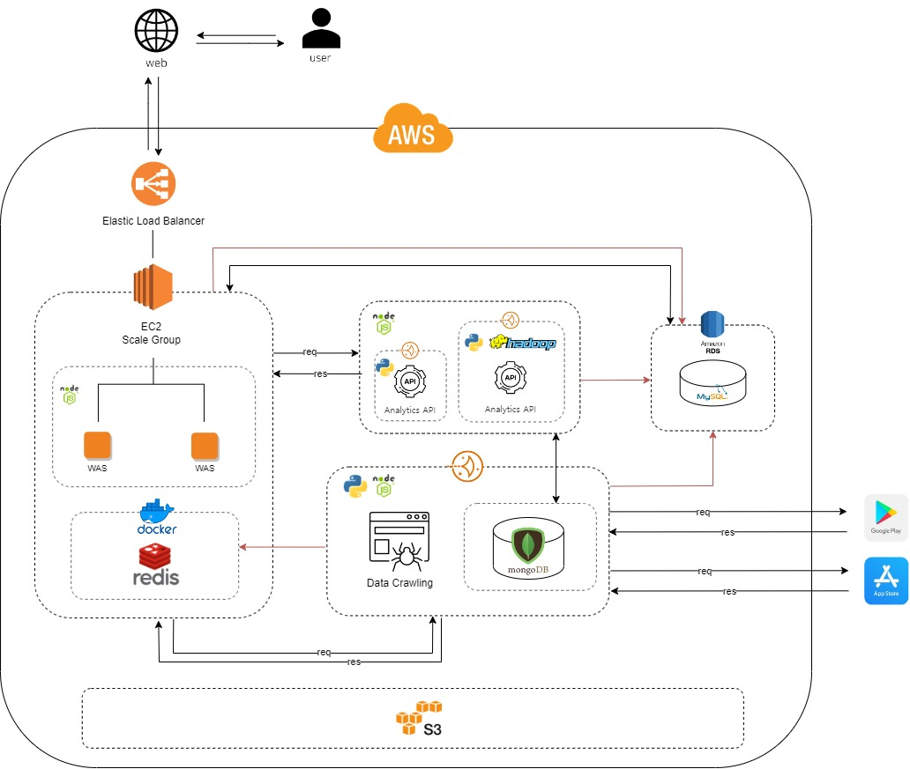
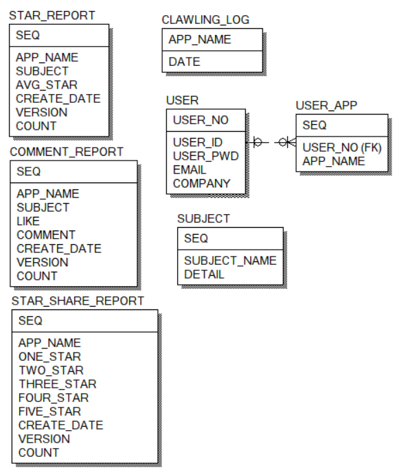
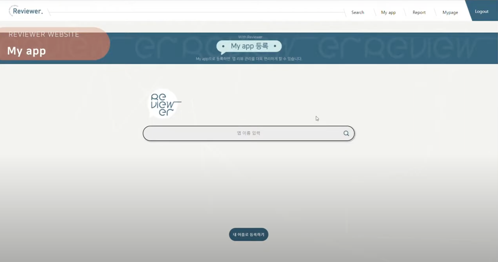
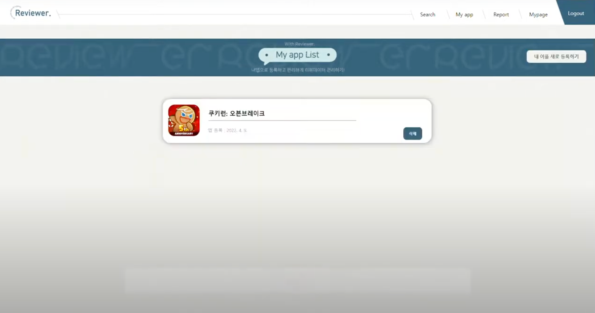
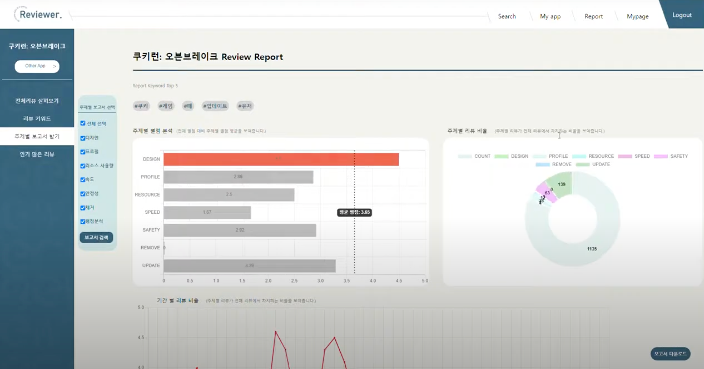
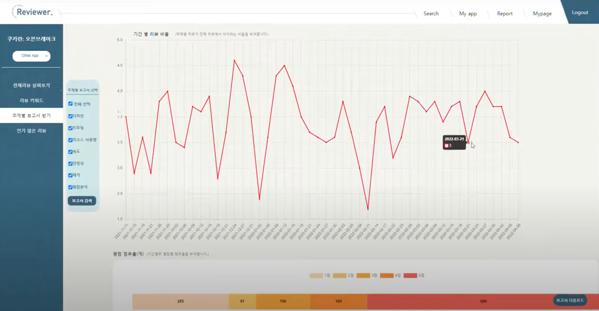
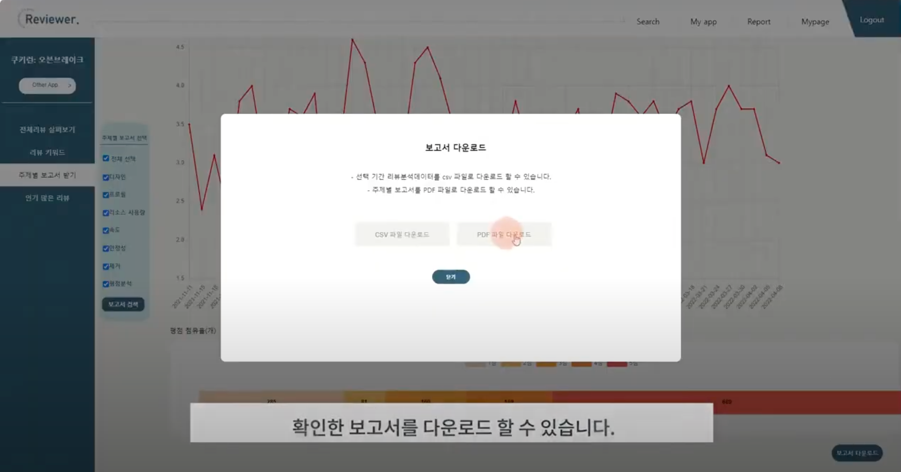
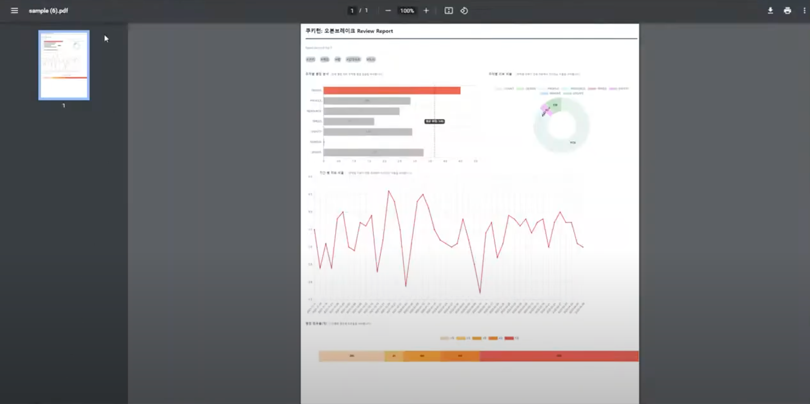
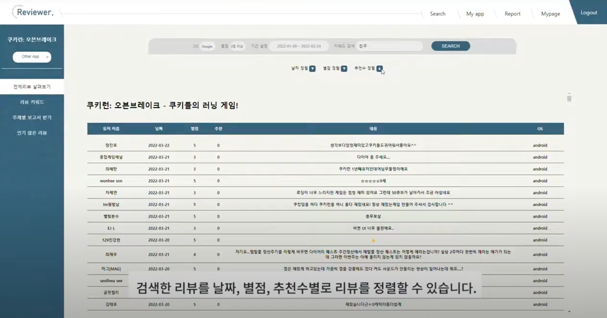
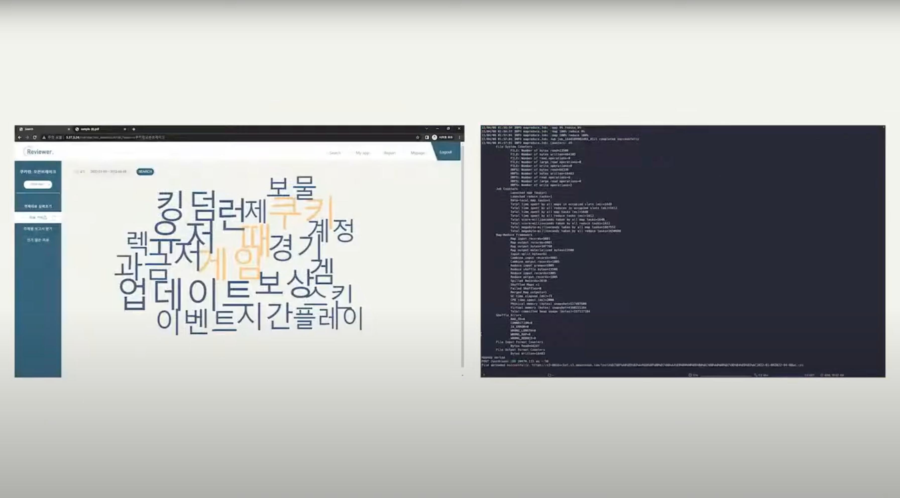

# 앱스토어 마켓 리뷰 웹 서비스

* [깃헙 소스코드](https://github.com/FinalAVO)
* [노션](https://www.notion.so/3-2c4398a2c12141699fc5282868c0af84)
* [YouTube 소개 영상](https://www.youtube.com/watch?v=EbHmLocgXqU)

## 프로젝트 개요 
애플리케이션 사용자의 리뷰 데이터를 받아 기업의 분석 및 개발에 중요한 자료로 활용할 수 있는 웹 서비스입니다.

<table align="center">
  <tr>
    <th>프로젝트 기간</th>
    <td>2022.01 ~ 2022.04 (3개월)</td>
  </tr>
  <tr>
    <th>목표 설정</th>
    <td>어플 리뷰에 대한 객관적 분석 가능</td>
  </tr>
  <tr>
    <th>기대 효과</th>
    <td>
      1. 사용자가 마켓에 대해 어떠한 생각을 가지고 있는지 알 수 있음  
      2. 피드백을 통한 개선점을 파악 가능  
      3. 마케팅 부서에 중요한 자원
    </td>
  </tr>
</table>

## 프로젝트 과정

### SAD(System Architecture Diagram)

  

### ERD(ER-Diagram)

  

### 앱 찾기 기능

  
  &nbsp;&nbsp;&nbsp;&nbsp;
  

### 리포트 기능

  
  &nbsp;&nbsp;&nbsp;&nbsp;
  

### 다운로드 기능

  
  &nbsp;&nbsp;&nbsp;&nbsp;
  

### 리뷰 살펴보기 기능

  
  &nbsp;&nbsp;&nbsp;&nbsp;
  

  자주 언급된 상위 20개의 키워드를 Hadoop을 통해 추출 후 워드클라우드화

